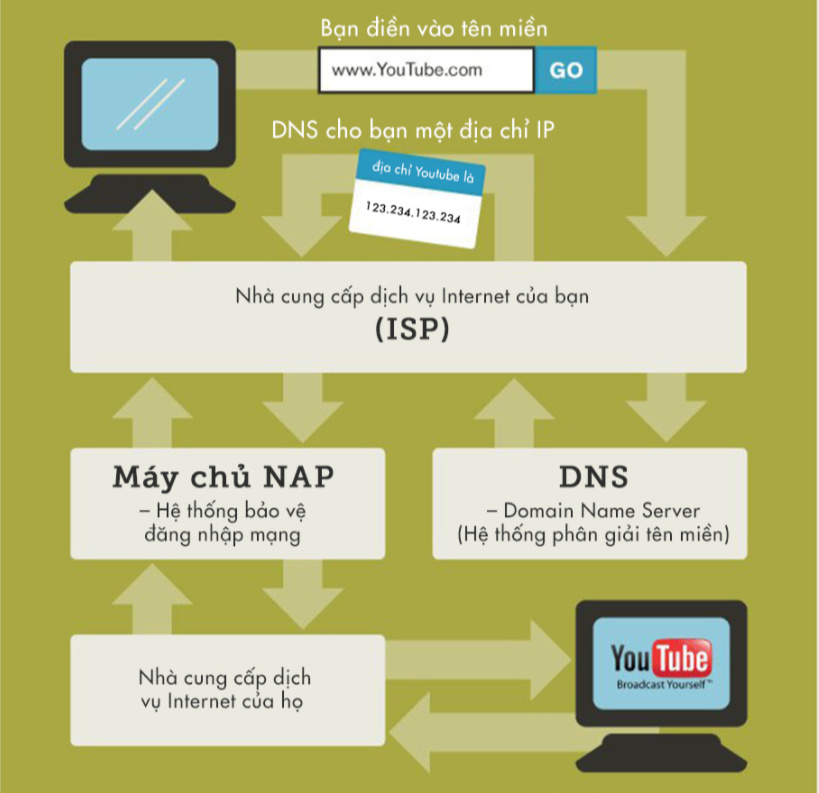

# **Tìm hiểu về Internet**

## **I: Internet là gì? Nó làm việc như thế nào ?**
### 1. Internet là gì? 
    Internet là một hệ thống thông tin toàn cầu có thể được truy nhập công cộng gồm các mạng máy tính được liên kết với nhau. Hệ thống này truyền thông tin theo kiểu nối chuyển gói dữ liệu (packet switching) dựa trên một giao thức liên mạng đã được chuẩn hóa (giao thức IP).
### 2. Internet làm việc như thế nào?

    Nói tổng quát là khi truy cập một trang web, máy tính sẽ gửi một yêu cầu qua các dây cáp tới một máy chủ. Máy chủ là nơi lưu trữ các trang web và nó hoạt động giống như ổ cứng máy tính. Khi yêu cầu đến, máy chủ sẽ truy xuất trang web và gửi dữ liệu chính xác trở lại máy tính và tất cả điều này xảy ra chỉ trong vài giây. 
Bây giờ, hãy nói chi tiết cách nó hoạt động của nó:

***Ngôn ngữ:***  Mọi hoạt động trên internet phụ thuộc vào việc các máy tính có khả năng trao đổi với nhau được hay không. Vì vậy, chúng cần một ngôn ngữ chung hoặc một bộ giao thức chung đó là **`Bộ giao thức liên mạng (TCP/IP)`**.

***Địa chỉ:***  Để các máy tính có thể kết nối được với nhau, chúng cần những địa chỉ, có thể hiểu những địa chỉ này như những cái tên. Mỗi địa chỉ là một dãy các con số (VD:168.56.7.0).  **`Những địa chỉ này được gọi là địa chỉ IP`**.

***Máy tính có địa chỉ IP bằng cách nào?***  **`  Nhà cung cấp dịch vụ Internet(ISP - Internet service provider) của bạn nắm giữ các IP `**. Họ cấp cho bạn một địa chỉ IP động hoặc tĩnh, tùy vào phương thức kết nối mà bạn có. Địa chỉ IP động sẽ thay đổi mỗi khi bạn đăng nhập. IP tĩnh thì không thay đổi.

***Cách truyền thông tin:*** Yêu cầu được gửi đi từ ISP của bạn, đến máy chủ NAP, qua ISP của người kia, đến một máy tính khác và thông tin được truyền ngược lại bạn.

***Cách hoạt động của Internet dưới góc nhìn vật lý*** 

Máy tính chuyển những thông tin mà bạn tải lên thành chuỗi những dãy số nhị phân.

Dãy số này sau đó được chuyển thành những tín hiệu điện tử - những tín hiệu điện tử này được truyền đi qua những kết nối có dây (LAN) hoặc các bước sống vô tuyến (Wifi) đến một bộ router đóng vài trò trung chuyển gửi những thông tin đến ISP.

ISP tiếp tục truyền chúng qua các hệ thống cáp quang dưới dạng ánh sáng.

Ở đầu nhận thông tin, ánh sáng được chuyển lại thành các tín hiệu điện tử, về lại dạng nhị phân. Sau đó, có thể chuyển thành chữ viết, hình ảnh, âm thanh hoặc video.

## **II: HTTP là gì ?**
    "Http (HyperText Transfer Protocol)" là giao thức truyền tải siêu văn bản được sử dụng trong www dùng để truyền tải dữ liệu giữa Web server đến các trình duyệt Web và ngược lại. Giao thức này sử dụng cổng 80 (port 80) là chủ yếu.

    Hay có thể hiểu khi bạn gõ vào 1 địa chỉ vào trình duyệt Web, lúc này trình duyệt Web sẽ gửi 1 yêu cầu qua giao thức Http đến Web server. Web server và sẽ nhận yêu cầu này và trả lại kết quả cho trình duyệt Web.

    "Https (HyperText Transfer Protocol Secure)" là giao thức Http có sử dụng thêm SSL (Secure Sockets Layer) để mã hóa dữ liệu trong lúc truyền tải dữ liệu nhầm gia tăng thêm tính an toàn cho việc truyền dữ liệu giữa Web server và trình duyệt Web. Giao thức Https thì sử dụng cổng 433 để truyền dữ liệu.

**Cấu trúc cơ bản của HTTP**: 

*Miêu tả vị trí của HTTP trong sơ đồ cấu trúc của một ứng dụng web*

Giao thức HTTP là gì? HTTP còn là 1 giao thức Yêu cầu – Phản hồi dựa trên cấu trúc Client – Server. Client và Server giao tiếp với nhau bằng cách trao đổi các message độc lập (trái ngược với 1 luồng dữ liệu). Các message được gửi bởi client, thông thường là 1 trình duyệt web, được gọi là các yêu cầu và message được gửi bởi server như 1 sự trả lời, được gọi là phản hồi.

## **III: Browser là gì và nó làm việc như nào?**

    Browser hay còn gọi là trình duyệt web, cứ bất kể phần mềm nào cho phép bạn lướt web thì ta gọi là browser. Tuy nhiên để trở thành một browser thì phần mềm đó phải đáp ứng các đặc điểm sau đây:

        - Cho phép truy cập Website 
        - Biên dịch được mã HTML, CSS và Javascript
        - Cho phép lưu cookie
    
**Cách Browser làm việc:**

    Bước 1: Sau khi người dùng nhập địa chỉ (URL) vào thanh tìm kiếm thì Browser sẽ gửi 1 yêu cầu (request) tới Web sever của trang web về việc truy cập vào

    Bước 2: Web sever sau khi nhận được yêu cầu(request) thì sẽ phản hồi(reponse) lại cho người dùng HTML code(bên trong chữa các đường link để tạo thành web như js, css, png,...)

    Bước 3: Trình duyệt sẽ nhận, và kiểm tra sau đó lại gửi yêu cầu(request) về việc truy xuất các đường link js,css,image,... và web sever sẽ trả lại cho trình duyệt

    Bước 3: Trình duyệt sẽ nhận kết quả trả lại và vẽ nên giao diện của trang web đó.

## **IV: DNS là gì và nó làm việc như nào ?**

    DNS là viết tắt của cụm từ Domain Name System, mang ý nghĩa đầy đủ là hệ thống phân giải tên miền. Hiểu một cách ngắn gọn nhất, DNS cơ bản là một hệ thống chuyển đổi các tên miền website mà chúng ta đang sử dụng, ở dạng www.tenmien.com sang một địa chỉ IP dạng số tương ứng với tên miền đó và ngược lại.

**Chức năng của DNS**

Người dùng thì không thể nhớ các địa chỉ IP của trang web đó mà thay vào đó sẽ chỉ cần nhớ tên miền. Do đó, khái niệm tên miền được đưa ra, từ đó mỗi trang web sẽ được xác định với tên duy nhất. 

Còn các thiết bị mạng, vẫn phải sử dụng IP để liên kết với nhau thế nên DNS làm công việc như một người phiên dịch và người truyền đạt thông tin. DNS sẽ làm công việc dịch tên miền thành một địa chỉ IP hoặc ngược lại từ địa chỉ IP thành tên miền.

**Các loại DNS Sever và vai trò của nó**

    - Root Name Server: Chứa các thông tin, để tìm kiếm các máy chủ tên miền dữ liệu(authority) cho các tên miền thuộc mức cao nhất (top-level-domain).
    - Local Name Server: Chưa thông tin, để tìm kiếm các máy chủ tên miền lữu trữ cho các tên miền thấp hơn. Nó thường được duy trì bởi các doanh nghiệp, các nhà cung cấp dịch vụ Internet(ISPs)

**Cơ chế hoạt động của DNS**

Bạn muốn truy cập vào trang web là Abcxyz.vn

Trước hết chương trình trên máy người dùng sẽ gửi yêu cầu tìm kiếm địa chỉ IP ứng với tên miền Abcxyz.vn tới máy chủ quản lý tên miền(name server) cục bộ thuộc mạng của nó.(Máy chủ của các nhà cùng cấp mạng như viettel, VNPT,...)

Máy chủ miền cục bộ này sẽ kiểm tra trong cơ sở dữ liệu của nó có chứa cơ sở dữ liệu chuyển đổi từ tên miền sang IP của tên miền Abcxyz.vn chưa. Nếu có rồi thì sẽ trả lại đỉa chị IP của tên miền nói trên.

Nếu chưa có cơ sở dữ liệu ấy, thì nó sẽ gửi yêu cầu lên các máy chủ tền miền ở mức cao nhất (Root). Máy chủ tên miền ở mức root sẽ chỉ cho máy chủ tên miền cục bộ địa chỉ của máy chủ tên miền quản lý các tên miền có đuôi là .vn

Tiếp đó máy chủ tên miền cục bộ gửi yêu cầu đến máy chủ quản lý tên miền .vn và tìm tên miền Abcxyz.vn

Máy chủ quản lý các tên miền .vn sẽ trả về cho máy chủ cục bộ địa chị IP của Abcxyz.vn. 

Cuối cùng máy chủ tên miền cục bộ sẽ lữu trữ địa chỉ IP của Abcxyz. Sau đó sẽ chuyển thông tin tìm được đến người sử dụng. Người sử dụng dùng địa chỉ IP này để kết nối đến sever chứa trang web Abcxyz

## **V: Hosting là gì**

Hosting (web hotsting) là một dịch vụ online giúp bạn xuất bản website hoặc ứng dụng web lên Internet. Khi bạn đăng ký dịch vụ hosting tức là bạn thuê một chỗ đặt trên server chứa tất cả các files và dữ liệu cần thiết để website của bạn chạy được.

Một server là 1 máy tính vật lý chạy không gian đoạn để website của bạn có thể luôn hoạt động mọi lúc cho tất cả mọi người truy cập vào. Nhà cung cấp Web hosting của bạn chịu trách nhiệm cho việc giữ sever hoạt động, chống tấn công khỏi mã độc, và chuyển nội dung (văn bản, hình ảnh, files) từ server xuống trình duyệt người dùng.

**Web hosting hoạt động như thế nào?**

Khi tạo một website, thì cần tìm hiểu công ty hosting để cấp cho bạn một không gian lưu trữ web trên sever. Web hots của bạn sẽ chứa toàn bộ files, tài liệu, database. Bất kể có người nào gõ tên miền lên thanh địa chỉ của trình duyệt, hotsing sẽ chuyển toàn bộ file cần thiết từ sever xuống trình duyệt đó

Người sử dụng hosting tiến hành upload các files dữ liệu lên hosting cùng cấu hình hoạt động. Sau đó tiến hành truy cập vào hosting từ các thiết bị có kết nối internet thông qua việc gửi request đến địa chỉ IP hoặc tên miền, tại đây hosting sẽ trả về cho bạn các tập tin theo kết quả truy cập tương ứng. 

**Các loại hosting**

- Shared Hosting: là dịch vụ lưu trữ website nơi mà có rất nhiều web sever được kết nối với hệ thống internet. Shared hosting là gói hosting được chia nhỏ ra từ các reseller hosting.
    
    Mọi database, web platform, source code,.... đều được đặt trong một máy chủ vật lý và shared hosting sẽ chia sẻ các tài nguyên trên sever vật lý này.

    Ưu điểm: 
    
    - Tiết kiệm chi phí.
    - Dễ dàng trong việc quản lý.

    Nhược điểm
    - Cấu hình shared hosting không cao do bị giới hạn về dung lượng sử dụng.        
    - Tính bảo mật không cao, dễ bị tấn công cục bộ vì có quá nhiều người dùng trên một máy chủ.
    - Website sẽ bị chạy chậm lại khi có lượng truy cập lớn do tài nguyên trên máy chủ phân bổ không được hợp lý.

- VPS Hosting: VPS Hosting đó là giải pháp kết hợp giữa dedicated hosting và shared hosting. Tại đây, máy chủ vật lý sẽ được tiến hành cài đặt ứng dụng ảo để tạo ra nhiều server ảo.

    Loại web hosting này vẫn dùng chung với các người dùng khác, song phía nhà cung cấp sẽ tiến hành lập server vật lý có bộ nhớ, không gian, sức mạnh xử lý dành riêng cho bạn.

    Ưu điểm:
    - Dễ dàng nâng cấp.
    - Có tài nguyên server riêng với mức giá thấp do sử dụng server ảo nên không phải tiến hành mua hẳn server.
    - Khả năng truy cập lớn từ website khác mà không làm ảnh hưởng tới hiệu năng.
    - Khả năng tùy biến cao.

    Nhược điểm:

    - Đòi hỏi phải có kiến thức và kỹ thuật quản trị server.
    - So với Shared Hosting thì VPS Hosting có chi phí cao hơn.

- Cloud Hosting: Là dịch vụ hosting được vận hành dựa trên nền tảng điện toán đám mây, dịch vụ này cho phép bạn đặt website lên vùng đám mây. Bằng việc sử dụng công nghệ ảo hóa từ VPS Hosting, Cloud Hosting cho phép gộp tài nguyên từ nhiều server vật lý.

    Ưu điểm:
    - Tài nguyên cung cấp gần như vô hạn.
    - Sử dụng Cloud Hosting được xem là giải pháp tân tiến hơn so với VPS Hosting.
    - Mọi site của người dùng sẽ không bị ảnh hưởng nếu server hỏng hay có lỗi.
    - Tùy thuộc vào nhu cầu dùng mà tài nguyên sẽ được phân phối phù hợp.
    - Tiến hành phương thức thanh toán dựa vào mức độ sử dụng.

    Nhược điểm:
    - Người dùng khó có thể kiểm soát và quản lý giá
    - Không có quyền root
    - Yêu cầu người sử dụng cần phải có kiến thức, kỹ năng quản trị máy chủ ảo.

- WordPress Hosting: Là một dạng của shared hosting, WordPress Hosting được thiết kế dành riêng cho website WordPress, các server sẽ được thiết kế với cấu hình riêng, có site gắn plugin được cài sẵn.

   Ưu điểm:
    - WordPress Hosting dễ dàng sử dụng dành cho người mới làm quen
    - Hệ thống WordPress plugins và theme đã được tiến hành cài đặt sẵn
    - Hiệu năng sử dụng tốt cho WordPress site
    - Đòi hỏi đội ngũ kỹ thuật, hỗ trợ các vấn đề liên quan WordPress phải có kiến thức, kỹ thuật tốt.
    - Mức chi phí thấp
   Nhược điểm:
    - Dịch vụ được xây dựng trên hệ hosting tiên tiến nhất đó là Cloud Hosting
    - Chỉ chuyên dùng cho website WordPress.
    
- Dedicated Server Hosting: Là một server vật lý được thiết kế dành riêng cho người dùng, trong đó mọi dữ liệu tài nguyên đều được thiết kế dành riêng cho người sử dụng. Chính điều này sẽ giúp cho người sử dụng hoàn toàn quyết định đối với server tùy thích, cài đặt môi trường hosting riêng phù hợp với nhu cầu sử dụng.

   Ưu điểm:
    - Dịch vụ có tính bảo mật cao
    - Người dùng có toàn quyền kiểm soát đối với server
    - Quyền truy cập root
    - Tài nguyên đáng tin cậy vì chỉ được thiết kế dành riêng cho bạn mà không chia sẻ cho bất kì ai.

   Nhược điểm:
    - Mức chi phí chi trả dịch vụ cao
    - Đòi hỏi phải có kiến thức, kỹ năng chuyên sâu trong việc quản lý server.

